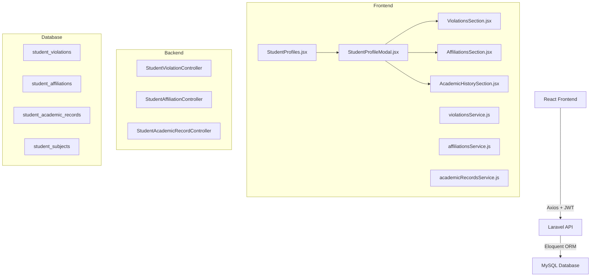
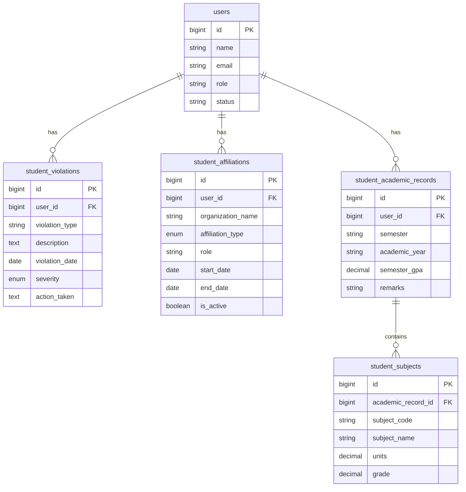

# Design Document

## Overview

This design covers four purely additive features for the existing Student Profiling System: Student Violations, Student Affiliations, Academic History, and a Status Filter UI. All new backend code follows the established patterns in `StudentSkill`/`StudentActivity` and `StudentController`. All new frontend code follows the existing service/component patterns in `studentProfileService` and `StudentProfileModal`.

No existing files are deleted or restructured. The only modifications to existing files are:
- `server/app/Models/User.php` — three new `hasMany` methods appended
- `server/routes/api.php` — three new route groups appended inside the existing `auth:api` + `check.status` middleware group
- `client/src/components/student-components/student-profile/StudentProfileModal.jsx` — three new section imports and render calls appended at the bottom of the scrollable content area
- `client/src/pages/admin-pages/StudentProfiles.jsx` — one new Status dropdown added to the existing filter grid

---

## Architecture

The system follows a standard three-tier architecture already in place:



Each new feature is self-contained: its own migration, model, controller, service file, and React component. The three new controllers are all scoped under `/students/{student}/...` to match the existing nested resource pattern implied by the requirements.

---

## Components and Interfaces

### Backend Controllers

All three controllers follow the same shape as `StudentController` — `Validator::make`, `DB::beginTransaction` where needed, and consistent JSON response structure `{ success, data, message }`.

**StudentViolationController**
- `index($studentId)` — `GET /students/{student}/violations`
- `store(Request, $studentId)` — `POST /students/{student}/violations`
- `update(Request, $studentId, $violationId)` — `PUT /students/{student}/violations/{violation}`
- `destroy($studentId, $violationId)` — `DELETE /students/{student}/violations/{violation}`

**StudentAffiliationController**
- `index($studentId)` — `GET /students/{student}/affiliations`
- `store(Request, $studentId)` — `POST /students/{student}/affiliations`
- `update(Request, $studentId, $affiliationId)` — `PUT /students/{student}/affiliations/{affiliation}`
- `destroy($studentId, $affiliationId)` — `DELETE /students/{student}/affiliations/{affiliation}`

**StudentAcademicRecordController**
- `index($studentId)` — `GET /students/{student}/academic-records`
- `store(Request, $studentId)` — `POST /students/{student}/academic-records` (wraps subjects in DB transaction)
- `update(Request, $studentId, $recordId)` — `PUT /students/{student}/academic-records/{record}` (replaces subjects in DB transaction)
- `destroy($studentId, $recordId)` — `DELETE /students/{student}/academic-records/{record}`

### Route Registration

New routes are appended inside the existing middleware group in `api.php`:

```php
// Student Violations
Route::get('students/{student}/violations', [StudentViolationController::class, 'index']);
Route::post('students/{student}/violations', [StudentViolationController::class, 'store']);
Route::put('students/{student}/violations/{violation}', [StudentViolationController::class, 'update']);
Route::delete('students/{student}/violations/{violation}', [StudentViolationController::class, 'destroy']);

// Student Affiliations
Route::get('students/{student}/affiliations', [StudentAffiliationController::class, 'index']);
Route::post('students/{student}/affiliations', [StudentAffiliationController::class, 'store']);
Route::put('students/{student}/affiliations/{affiliation}', [StudentAffiliationController::class, 'update']);
Route::delete('students/{student}/affiliations/{affiliation}', [StudentAffiliationController::class, 'destroy']);

// Academic Records
Route::get('students/{student}/academic-records', [StudentAcademicRecordController::class, 'index']);
Route::post('students/{student}/academic-records', [StudentAcademicRecordController::class, 'store']);
Route::put('students/{student}/academic-records/{record}', [StudentAcademicRecordController::class, 'update']);
Route::delete('students/{student}/academic-records/{record}', [StudentAcademicRecordController::class, 'destroy']);
```

### Frontend Services

Each service file mirrors `studentProfileService.js` — imports `axiosInstance`, exports a default object with async methods that return `{ success, data, message }`.

**violationsService.js** — `getViolations(studentId)`, `createViolation(studentId, data)`, `updateViolation(studentId, id, data)`, `deleteViolation(studentId, id)`

**affiliationsService.js** — `getAffiliations(studentId)`, `createAffiliation(studentId, data)`, `updateAffiliation(studentId, id, data)`, `deleteAffiliation(studentId, id)`

**academicRecordsService.js** — `getAcademicRecords(studentId)`, `createAcademicRecord(studentId, data)`, `updateAcademicRecord(studentId, id, data)`, `deleteAcademicRecord(studentId, id)`

### Frontend Components

Each section component receives `studentId` as a prop and manages its own TanStack Query `useQuery` + `useMutation` calls internally. They render:
1. A card header with section title and "Add" button
2. A table/list of existing records (or empty-state message)
3. An inline form (shown/hidden via local state) for add/edit
4. A confirmation prompt before delete

**ViolationsSection** — columns: violation type, severity badge, date, action taken; form fields: `violation_type`, `severity`, `violation_date`, `description`, `action_taken`

**AffiliationsSection** — columns: organization name, type, role, active status badge; form fields: `organization_name`, `affiliation_type`, `role`, `start_date`, `end_date`, `is_active`, `description`

**AcademicHistorySection** — collapsible semester rows; each row expands to show a subjects table (code, name, units, grade); form includes dynamic subject rows with add/remove

### Status Filter (StudentProfiles.jsx)

A new `status` key is added to the `filters` state object (default `'all'`). A new `<select>` is added as a fifth cell in the existing `grid-cols-1 sm:grid-cols-2 lg:grid-cols-4` filter grid (which becomes `lg:grid-cols-5`). The `queryParams` memo already conditionally includes filter keys — the same pattern is applied for `status`.

---

## Data Models

### student_violations

| Column | Type | Constraints |
|---|---|---|
| id | bigint unsigned | PK, auto-increment |
| user_id | bigint unsigned | FK → users(id), cascade delete |
| violation_type | varchar(100) | not null |
| description | text | nullable |
| violation_date | date | not null |
| severity | enum('minor','moderate','major') | not null |
| action_taken | text | nullable |
| created_at | timestamp | |
| updated_at | timestamp | |

Index: `user_id`

### student_affiliations

| Column | Type | Constraints |
|---|---|---|
| id | bigint unsigned | PK, auto-increment |
| user_id | bigint unsigned | FK → users(id), cascade delete |
| organization_name | varchar(255) | not null |
| affiliation_type | enum('academic_org','sports','civic','religious','political','other') | not null |
| role | varchar(100) | nullable |
| start_date | date | nullable |
| end_date | date | nullable |
| is_active | tinyint(1) | default 1 |
| description | text | nullable |
| created_at | timestamp | |
| updated_at | timestamp | |

Index: `user_id`

### student_academic_records

| Column | Type | Constraints |
|---|---|---|
| id | bigint unsigned | PK, auto-increment |
| user_id | bigint unsigned | FK → users(id), cascade delete |
| semester | varchar(20) | not null |
| academic_year | varchar(20) | not null |
| semester_gpa | decimal(3,2) | nullable |
| remarks | varchar(255) | nullable |
| created_at | timestamp | |
| updated_at | timestamp | |

Index: `user_id`

### student_subjects

| Column | Type | Constraints |
|---|---|---|
| id | bigint unsigned | PK, auto-increment |
| academic_record_id | bigint unsigned | FK → student_academic_records(id), cascade delete |
| subject_code | varchar(20) | nullable |
| subject_name | varchar(255) | not null |
| units | decimal(3,1) | not null |
| grade | decimal(4,2) | nullable |
| created_at | timestamp | |
| updated_at | timestamp | |

Index: `academic_record_id`

### Eloquent Relationships

```
User
  hasMany → StudentViolation    (violations())
  hasMany → StudentAffiliation  (affiliations())
  hasMany → StudentAcademicRecord (academicRecords())

StudentViolation    belongsTo → User
StudentAffiliation  belongsTo → User
StudentAcademicRecord
  belongsTo → User
  hasMany   → StudentSubject (subjects())
StudentSubject      belongsTo → StudentAcademicRecord
```

### ERD




## Correctness Properties

*A property is a characteristic or behavior that should hold true across all valid executions of a system — essentially, a formal statement about what the system should do. Properties serve as the bridge between human-readable specifications and machine-verifiable correctness guarantees.*

### Property 1: User relationship completeness

*For any* student user, calling `user->violations()`, `user->affiliations()`, and `user->academicRecords()` should each return only records whose `user_id` matches that user's `id`, and the count should equal the number of records inserted for that user.

**Validates: Requirements 1.3, 4.3, 7.5**

---

### Property 2: GET endpoints return records sorted correctly

*For any* student with any number of violation records inserted in arbitrary order, `GET /students/{student}/violations` should return those records sorted by `violation_date` descending. The same ordering guarantee applies to affiliations sorted by `start_date` descending, and academic records sorted by `academic_year` then `semester`.

**Validates: Requirements 2.2, 5.2, 8.2**

---

### Property 3: Create then retrieve round-trip

*For any* valid violation, affiliation, or academic record payload, a `POST` to the corresponding endpoint should return HTTP 201, and a subsequent `GET` for that student should include the newly created record with all submitted field values preserved.

**Validates: Requirements 2.3, 5.3, 8.3**

---

### Property 4: Update then retrieve round-trip

*For any* existing violation, affiliation, or academic record and any valid update payload, a `PUT` to the corresponding endpoint should return the updated record, and a subsequent `GET` should reflect the new field values.

**Validates: Requirements 2.4, 5.4, 8.4**

---

### Property 5: Delete then retrieve round-trip

*For any* existing violation, affiliation, or academic record, a `DELETE` to the corresponding endpoint should return HTTP 200, and a subsequent `GET` for that student should no longer include the deleted record.

**Validates: Requirements 2.5, 5.5, 8.5**

---

### Property 6: Validation rejection

*For any* request body that is missing a required field (`violation_type`, `violation_date`, or `severity` for violations; `organization_name` or `affiliation_type` for affiliations; `semester` or `academic_year` for academic records), the corresponding `POST` or `PUT` endpoint should return HTTP 422 with a non-empty `errors` object containing the offending field name as a key.

**Validates: Requirements 2.6, 5.6, 8.6**

---

### Property 7: Academic record subjects transaction integrity

*For any* valid `POST /students/{student}/academic-records` payload containing a `subjects` array of length N, the created academic record should have exactly N associated subjects in `student_subjects`, and if any subject row fails validation the entire record should not be persisted.

**Validates: Requirements 8.3**

---

### Property 8: Academic record subject replacement

*For any* existing academic record with subjects S1, a valid `PUT` with a new subjects array S2 should result in the record having exactly the subjects in S2 — none of S1 should remain unless they also appear in S2.

**Validates: Requirements 8.4**

---

### Property 9: Academic record cascade delete

*For any* existing academic record with one or more subjects, deleting the academic record should also remove all its associated `student_subjects` rows.

**Validates: Requirements 8.5**

---

### Property 10: Section components render all record fields

*For any* non-empty list of violations passed to `ViolationsSection`, the rendered output should contain the `violation_type`, `severity`, `violation_date`, and `action_taken` values for each record. The same completeness guarantee applies to `AffiliationsSection` (organization name, type, role, active status) and `AcademicHistorySection` (semester, academic year, and subject rows on expand).

**Validates: Requirements 3.1, 6.1, 9.1**

---

### Property 11: Form submission triggers mutation and cache update

*For any* valid form submission in ViolationsSection, AffiliationsSection, or AcademicHistorySection, the corresponding TanStack Query mutation should be called with the submitted data, and the query cache for that student's list should be invalidated so the UI reflects the new state.

**Validates: Requirements 3.4, 6.4, 9.4**

---

### Property 12: Edit pre-population

*For any* existing record displayed in ViolationsSection, AffiliationsSection, or AcademicHistorySection, clicking the edit action should populate every form field with the current value of the corresponding record field.

**Validates: Requirements 3.5, 6.5, 9.5**

---

### Property 13: API error display without crash

*For any* API error response (4xx or 5xx) returned while fetching or mutating violations, affiliations, or academic records, the corresponding section component should display the error message text and remain mounted (not unmount or throw an unhandled exception).

**Validates: Requirements 3.7, 6.7, 9.7**

---

### Property 14: Status filter queryParams correctness

*For any* status value selected in the Status dropdown: if the value is not `'all'`, the `queryParams` object passed to `useStudents` should contain `{ status: <value> }`; if the value is `'all'`, the `queryParams` object should not contain a `status` key at all.

**Validates: Requirements 10.2, 10.3**

---

## Error Handling

### Backend

- **404 — Student not found**: All three controllers look up the student with `User::where('role', 'student')->findOrFail($id)`. Laravel's `findOrFail` throws `ModelNotFoundException`, which is caught and returned as `{ success: false, message: 'Student not found' }` with HTTP 404.
- **422 — Validation failure**: `Validator::make` is used in `store` and `update` actions. On failure, `{ success: false, errors: $validator->errors() }` is returned with HTTP 422. Field-level keys match the request field names so the frontend can map them directly.
- **404 — Sub-resource not found**: Violation/affiliation/record lookups are scoped to the parent student (`->where('user_id', $studentId)->findOrFail($id)`) to prevent cross-student access and return 404 for missing records.
- **500 — Unexpected errors**: All controller actions are wrapped in try/catch. Exceptions return `{ success: false, message: 'Failed to ...: ' . $e->getMessage() }` with HTTP 500, matching the existing `StudentController` pattern.
- **Transaction rollback**: `StudentAcademicRecordController@store` and `@update` use `DB::beginTransaction` / `DB::commit` / `DB::rollBack` to ensure subjects are never partially written.

### Frontend

- **Query errors**: Each section component uses TanStack Query's `error` state from `useQuery`. When `error` is non-null, an error banner is rendered inside the card instead of the list.
- **Mutation errors**: `useMutation`'s `onError` callback sets local error state displayed inline in the form. The component remains mounted.
- **Empty states**: When `data` is an empty array, a styled empty-state message is shown (e.g., "No violations on record").
- **Confirmation before delete**: A local boolean state (`showConfirm`) gates the delete API call. The UI shows a confirmation prompt; the actual `deleteViolation` / `deleteAffiliation` / `deleteAcademicRecord` call only fires on explicit confirmation.

---

## Testing Strategy

### Dual Testing Approach

Both unit tests and property-based tests are required. Unit tests cover specific examples, integration points, and edge cases. Property-based tests verify universal correctness across randomized inputs.

### Backend Testing (PHP — PestPHP + Laravel HTTP tests)

**Property-based testing library**: [Pest](https://pestphp.com/) with [pest-plugin-faker](https://github.com/pestphp/pest-plugin-faker) for data generation. Each property test runs a minimum of 100 iterations via a custom `dataset` generator or a loop inside the test body.

**Unit / example tests**:
- Migration schema assertions (table exists, columns exist with correct types)
- Model relationship assertions (belongsTo, hasMany return correct instances)
- Empty-state responses (student with no violations returns empty array)
- 404 for non-existent student ID
- 422 response shape (errors object contains expected field keys)

**Property tests**:

```
// Feature: missing-student-data-features, Property 2: GET endpoints return records sorted correctly
it('returns violations sorted by violation_date descending for any student', function () { ... });

// Feature: missing-student-data-features, Property 3: Create then retrieve round-trip
it('POST violation then GET includes the created record for any valid payload', function () { ... });

// Feature: missing-student-data-features, Property 4: Update then retrieve round-trip
it('PUT violation then GET reflects updated fields for any valid payload', function () { ... });

// Feature: missing-student-data-features, Property 5: Delete then retrieve round-trip
it('DELETE violation then GET no longer includes the record', function () { ... });

// Feature: missing-student-data-features, Property 6: Validation rejection
it('POST with missing required fields returns 422 with field errors', function () { ... });

// Feature: missing-student-data-features, Property 7: Academic record subjects transaction integrity
it('POST academic-record creates exactly N subjects for any subjects array of length N', function () { ... });

// Feature: missing-student-data-features, Property 8: Academic record subject replacement
it('PUT academic-record replaces subjects completely', function () { ... });

// Feature: missing-student-data-features, Property 9: Academic record cascade delete
it('DELETE academic-record removes all associated subjects', function () { ... });
```

### Frontend Testing (JavaScript — Vitest + React Testing Library + fast-check)

**Property-based testing library**: [fast-check](https://fast-check.io/) for arbitrary data generation. Each `fc.assert` call uses `{ numRuns: 100 }`.

**Unit / example tests**:
- ViolationsSection renders empty-state message when passed an empty array
- AffiliationsSection renders empty-state message when passed an empty array
- AcademicHistorySection renders empty-state message when passed an empty array
- Clicking "Add Violation" reveals the form
- Clicking "Delete" shows the confirmation prompt
- Status dropdown renders exactly four `<option>` elements

**Property tests**:

```javascript
// Feature: missing-student-data-features, Property 10: Section components render all record fields
fc.assert(fc.asyncProperty(fc.array(violationArbitrary, { minLength: 1 }), async (violations) => {
  // render ViolationsSection with violations, assert all fields present
}), { numRuns: 100 });

// Feature: missing-student-data-features, Property 11: Form submission triggers mutation and cache update
fc.assert(fc.asyncProperty(validViolationArbitrary, async (data) => {
  // submit form, assert mutation called with data, query invalidated
}), { numRuns: 100 });

// Feature: missing-student-data-features, Property 12: Edit pre-population
fc.assert(fc.asyncProperty(violationArbitrary, async (violation) => {
  // click edit on violation row, assert each form field equals violation[field]
}), { numRuns: 100 });

// Feature: missing-student-data-features, Property 13: API error display without crash
fc.assert(fc.asyncProperty(fc.string(), async (errorMessage) => {
  // mock API to reject with errorMessage, render section, assert message displayed, component mounted
}), { numRuns: 100 });

// Feature: missing-student-data-features, Property 14: Status filter queryParams correctness
fc.assert(fc.property(
  fc.oneof(fc.constant('active'), fc.constant('inactive'), fc.constant('suspended'), fc.constant('all')),
  (status) => {
    // simulate filter change, inspect queryParams, assert presence/absence of status key
  }
), { numRuns: 100 });
```
