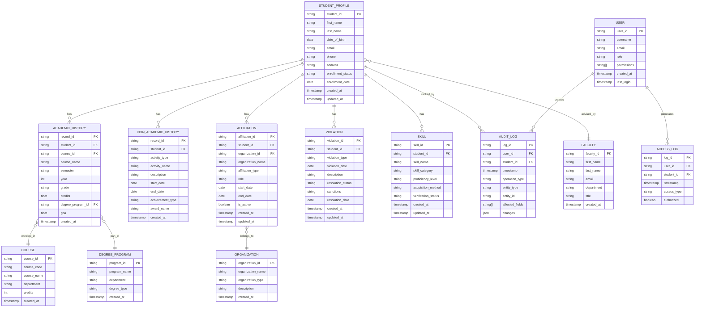

# Design Document: Student Profiling System

## Overview

The Student Profiling System is a comprehensive data management platform designed to centralize and organize all dimensions of student information within an educational institution. The system provides a unified view of each student's academic performance, extracurricular activities, organizational affiliations, disciplinary records, and skill profiles.

### Design Goals

1. **Centralized Data Repository**: Consolidate all student-related information in a single, coherent data model
2. **High-Performance Querying**: Enable sub-second retrieval of student profiles through optimized database design and indexing
3. **Data Integrity**: Maintain referential integrity and consistency across all related data entities
4. **Scalability**: Support growth to 50,000+ student profiles with consistent performance
5. **Security and Privacy**: Implement role-based access control to protect sensitive student information
6. **Auditability**: Maintain comprehensive audit trails for compliance and accountability
7. **Integration-Ready**: Provide APIs for seamless integration with existing academic systems

### Key Design Decisions

- **Relational Database Model**: Use a normalized relational database to ensure data integrity and support complex queries
- **Indexed Query Optimization**: Strategic indexing on frequently queried fields (student ID, name, affiliation, skills)
- **Caching Layer**: Implement application-level caching for frequently accessed profiles
- **RESTful API**: Expose functionality through a RESTful API for external system integration
- **Event-Driven Audit Logging**: Use database triggers and application-level event handlers for comprehensive audit trails
- **Role-Based Access Control (RBAC)**: Implement fine-grained permissions based on user roles and data sensitivity

## Architecture

### System Architecture

The Student Profiling System follows a three-tier architecture:

```
┌─────────────────────────────────────────────────────────────┐
│                     Presentation Layer                       │
│  ┌──────────────┐  ┌──────────────┐  ┌──────────────┐      │
│  │   Web UI     │  │  Mobile App  │  │  External    │      │
│  │              │  │              │  │  Systems     │      │
│  └──────────────┘  └──────────────┘  └──────────────┘      │
└─────────────────────────────────────────────────────────────┘
                            │
                            ▼
┌─────────────────────────────────────────────────────────────┐
│                     Application Layer                        │
│  ┌──────────────────────────────────────────────────────┐   │
│  │              RESTful API Service                     │   │
│  │  ┌────────────┐  ┌────────────┐  ┌────────────┐    │   │
│  │  │  Profile   │  │   Query    │  │   Auth     │    │   │
│  │  │  Manager   │  │   Engine   │  │   Service  │    │   │
│  │  └────────────┘  └────────────┘  └────────────┘    │   │
│  └──────────────────────────────────────────────────────┘   │
│  ┌──────────────────────────────────────────────────────┐   │
│  │              Business Logic Layer                    │   │
│  │  ┌────────────┐  ┌────────────┐  ┌────────────┐    │   │
│  │  │ Validation │  │   Export   │  │   Audit    │    │   │
│  │  │  Service   │  │   Service  │  │   Logger   │    │   │
│  │  └────────────┘  └────────────┘  └────────────┘    │   │
│  └──────────────────────────────────────────────────────┘   │
│  ┌──────────────────────────────────────────────────────┐   │
│  │              Caching Layer (Redis)                   │   │
│  └──────────────────────────────────────────────────────┘   │
└─────────────────────────────────────────────────────────────┘
                            │
                            ▼
┌─────────────────────────────────────────────────────────────┐
│                      Data Layer                              │
│  ┌──────────────────────────────────────────────────────┐   │
│  │         Relational Database (PostgreSQL)             │   │
│  │  ┌────────────┐  ┌────────────┐  ┌────────────┐    │   │
│  │  │  Student   │  │  Academic  │  │    Audit   │    │   │
│  │  │  Profiles  │  │   Data     │  │    Logs    │    │   │
│  │  └────────────┘  └────────────┘  └────────────┘    │   │
│  └──────────────────────────────────────────────────────┘   │
│  ┌──────────────────────────────────────────────────────┐   │
│  │         Backup Storage (S3/Object Storage)           │   │
│  └──────────────────────────────────────────────────────┘   │
└─────────────────────────────────────────────────────────────┘
```

### Component Responsibilities

**Presentation Layer**:
- Web UI: Browser-based interface for administrators, faculty, and staff
- Mobile App: Mobile access for authorized users
- External Systems: Integration points for academic management systems

**Application Layer**:
- **Profile Manager**: Handles CRUD operations for student profiles and related entities
- **Query Engine**: Processes search and filter requests with optimization
- **Auth Service**: Manages authentication and authorization
- **Validation Service**: Validates all input data against business rules
- **Export Service**: Generates exports in JSON, CSV, and PDF formats
- **Audit Logger**: Records all data access and modification events
- **Caching Layer**: Redis-based cache for frequently accessed profiles

**Data Layer**:
- **Relational Database**: PostgreSQL for transactional data storage
- **Backup Storage**: Automated daily backups with 90-day retention

## Components and Interfaces

### Core Components

#### 1. Profile Manager Component

**Responsibilities**:
- Create, read, update, and delete student profiles
- Manage associated entities (academic history, affiliations, skills, violations)
- Coordinate with validation service before persisting data
- Trigger audit logging for all operations

**Interfaces**:
```typescript
interface ProfileManager {
  createProfile(profileData: StudentProfileInput): Promise<StudentProfile>;
  getProfile(studentId: string): Promise<StudentProfile>;
  updateProfile(studentId: string, updates: Partial<StudentProfileInput>): Promise<StudentProfile>;
  deleteProfile(studentId: string): Promise<void>;
  
  addAcademicRecord(studentId: string, record: AcademicRecordInput): Promise<AcademicRecord>;
  addNonAcademicRecord(studentId: string, record: NonAcademicRecordInput): Promise<NonAcademicRecord>;
  addAffiliation(studentId: string, affiliation: AffiliationInput): Promise<Affiliation>;
  addViolation(studentId: string, violation: ViolationInput): Promise<Violation>;
  addSkill(studentId: string, skill: SkillInput): Promise<Skill>;
}
```

#### 2. Query Engine Component

**Responsibilities**:
- Process profile queries with single or multiple criteria
- Optimize query execution using indexes and caching
- Implement pagination for large result sets
- Enforce query performance requirements (500ms for ID, 1s for name, 2s for complex)

**Interfaces**:
```typescript
interface QueryEngine {
  queryByStudentId(studentId: string): Promise<StudentProfile>;
  queryByName(name: string): Promise<StudentProfile[]>;
  queryByAffiliation(organizationName: string): Promise<StudentProfile[]>;
  queryBySkill(skillName: string): Promise<StudentProfile[]>;
  queryByProgram(programName: string): Promise<StudentProfile[]>;
  
  advancedSearch(criteria: SearchCriteria): Promise<PaginatedResult<StudentProfile>>;
  queryByCourse(courseId: string): Promise<StudentProfile[]>;
  queryByAdvisor(advisorId: string): Promise<StudentProfile[]>;
}

interface SearchCriteria {
  academicFilters?: AcademicFilter[];
  nonAcademicFilters?: NonAcademicFilter[];
  affiliationFilters?: AffiliationFilter[];
  skillFilters?: SkillFilter[];
  violationFilters?: ViolationFilter[];
  logicalOperator: 'AND' | 'OR';
  pagination?: PaginationParams;
}
```

#### 3. Authentication and Authorization Component

**Responsibilities**:
- Authenticate users before granting system access
- Verify user roles and permissions
- Enforce role-based access control (RBAC)
- Log unauthorized access attempts
- Require additional authentication for sensitive data

**Interfaces**:
```typescript
interface AuthService {
  authenticate(credentials: UserCredentials): Promise<AuthToken>;
  verifyToken(token: string): Promise<User>;
  checkPermission(user: User, resource: Resource, action: Action): Promise<boolean>;
  requireAdditionalAuth(user: User, sensitiveResource: Resource): Promise<boolean>;
  logUnauthorizedAccess(user: User, resource: Resource, action: Action): Promise<void>;
}

enum Role {
  ADMINISTRATOR = 'ADMINISTRATOR',
  FACULTY = 'FACULTY',
  ADVISOR = 'ADVISOR',
  DISCIPLINARY_OFFICER = 'DISCIPLINARY_OFFICER',
  CAREER_COUNSELOR = 'CAREER_COUNSELOR',
  RESEARCHER = 'RESEARCHER',
  SECURITY_ADMIN = 'SECURITY_ADMIN'
}

enum Permission {
  READ_BASIC_PROFILE = 'READ_BASIC_PROFILE',
  READ_ACADEMIC_HISTORY = 'READ_ACADEMIC_HISTORY',
  READ_NON_ACADEMIC_HISTORY = 'READ_NON_ACADEMIC_HISTORY',
  READ_VIOLATIONS = 'READ_VIOLATIONS',
  WRITE_PROFILE = 'WRITE_PROFILE',
  WRITE_VIOLATIONS = 'WRITE_VIOLATIONS',
  EXPORT_DATA = 'EXPORT_DATA',
  MANAGE_USERS = 'MANAGE_USERS'
}
```

#### 4. Validation Service Component

**Responsibilities**:
- Validate required fields are present
- Validate data types and formats
- Validate date logic and sequencing
- Validate referential integrity
- Return descriptive error messages

**Interfaces**:
```typescript
interface ValidationService {
  validateStudentProfile(data: StudentProfileInput): ValidationResult;
  validateAcademicRecord(data: AcademicRecordInput): ValidationResult;
  validateNonAcademicRecord(data: NonAcademicRecordInput): ValidationResult;
  validateAffiliation(data: AffiliationInput): ValidationResult;
  validateViolation(data: ViolationInput): ValidationResult;
  validateSkill(data: SkillInput): ValidationResult;
  validateDateSequence(startDate: Date, endDate: Date): ValidationResult;
  validateEntityExists(entityType: string, entityId: string): Promise<boolean>;
}

interface ValidationResult {
  isValid: boolean;
  errors: ValidationError[];
}

interface ValidationError {
  field: string;
  message: string;
  code: string;
}
```

#### 5. Export Service Component

**Responsibilities**:
- Export profiles in JSON, CSV, and PDF formats
- Include all selected profile components
- Respect access control permissions
- Support single and batch exports

**Interfaces**:
```typescript
interface ExportService {
  exportToJSON(studentIds: string[], components: ProfileComponent[]): Promise<string>;
  exportToCSV(studentIds: string[], components: ProfileComponent[]): Promise<string>;
  exportToPDF(studentIds: string[], components: ProfileComponent[]): Promise<Buffer>;
  
  validateExportPermissions(user: User, studentIds: string[]): Promise<boolean>;
}

enum ProfileComponent {
  BASIC_INFO = 'BASIC_INFO',
  ACADEMIC_HISTORY = 'ACADEMIC_HISTORY',
  NON_ACADEMIC_HISTORY = 'NON_ACADEMIC_HISTORY',
  AFFILIATIONS = 'AFFILIATIONS',
  VIOLATIONS = 'VIOLATIONS',
  SKILLS = 'SKILLS'
}
```

#### 6. Audit Logger Component

**Responsibilities**:
- Log all create, update, and delete operations
- Record user identifier, timestamp, operation type, and affected fields
- Retain logs for minimum 7 years
- Provide query interface for audit trail review

**Interfaces**:
```typescript
interface AuditLogger {
  logCreate(user: User, entity: string, entityId: string, data: any): Promise<void>;
  logUpdate(user: User, entity: string, entityId: string, changes: FieldChange[]): Promise<void>;
  logDelete(user: User, entity: string, entityId: string): Promise<void>;
  logAccess(user: User, entity: string, entityId: string): Promise<void>;
  
  queryAuditLog(criteria: AuditQueryCriteria): Promise<AuditLogEntry[]>;
}

interface AuditLogEntry {
  id: string;
  userId: string;
  timestamp: Date;
  operationType: 'CREATE' | 'UPDATE' | 'DELETE' | 'ACCESS';
  entityType: string;
  entityId: string;
  affectedFields?: string[];
  changes?: FieldChange[];
}

interface FieldChange {
  field: string;
  oldValue: any;
  newValue: any;
}
```

### API Endpoints

The system exposes a RESTful API for external integration:

```
# Profile Management
POST   /api/v1/profiles                    # Create new profile
GET    /api/v1/profiles/:id                # Get profile by ID
PUT    /api/v1/profiles/:id                # Update profile
DELETE /api/v1/profiles/:id                # Delete profile

# Academic History
POST   /api/v1/profiles/:id/academic       # Add academic record
GET    /api/v1/profiles/:id/academic       # Get academic history

# Non-Academic History
POST   /api/v1/profiles/:id/non-academic   # Add non-academic record
GET    /api/v1/profiles/:id/non-academic   # Get non-academic history

# Affiliations
POST   /api/v1/profiles/:id/affiliations   # Add affiliation
GET    /api/v1/profiles/:id/affiliations   # Get affiliations
PUT    /api/v1/affiliations/:affiliationId # Update affiliation

# Violations
POST   /api/v1/profiles/:id/violations     # Record violation
GET    /api/v1/profiles/:id/violations     # Get violations
PUT    /api/v1/violations/:violationId     # Update violation

# Skills
POST   /api/v1/profiles/:id/skills         # Add skill
GET    /api/v1/profiles/:id/skills         # Get skills
PUT    /api/v1/skills/:skillId             # Update skill

# Querying
GET    /api/v1/search                      # Advanced search
GET    /api/v1/search/by-name              # Search by name
GET    /api/v1/search/by-affiliation       # Search by affiliation
GET    /api/v1/search/by-skill             # Search by skill
GET    /api/v1/search/by-program           # Search by program
GET    /api/v1/search/by-course            # Search by course
GET    /api/v1/search/by-advisor           # Search by advisor

# Export
POST   /api/v1/export/json                 # Export to JSON
POST   /api/v1/export/csv                  # Export to CSV
POST   /api/v1/export/pdf                  # Export to PDF

# Audit
GET    /api/v1/audit                       # Query audit logs
```

## Data Models

### Entity Relationship Diagram (ERD)

The following ERD illustrates the Faculty and Student Data Map with all entities and their relationships:



### Database Schema

#### Student_Profile Table

```sql
CREATE TABLE student_profile (
    student_id VARCHAR(50) PRIMARY KEY,
    first_name VARCHAR(100) NOT NULL,
    last_name VARCHAR(100) NOT NULL,
    date_of_birth DATE NOT NULL,
    email VARCHAR(255) UNIQUE NOT NULL,
    phone VARCHAR(20),
    address TEXT,
    enrollment_status VARCHAR(20) NOT NULL CHECK (enrollment_status IN ('ACTIVE', 'INACTIVE', 'GRADUATED', 'SUSPENDED')),
    enrollment_date DATE NOT NULL,
    faculty_advisor_id VARCHAR(50) REFERENCES faculty(faculty_id),
    created_at TIMESTAMP DEFAULT CURRENT_TIMESTAMP,
    updated_at TIMESTAMP DEFAULT CURRENT_TIMESTAMP
);

CREATE INDEX idx_student_name ON student_profile(last_name, first_name);
CREATE INDEX idx_student_email ON student_profile(email);
CREATE INDEX idx_student_status ON student_profile(enrollment_status);
CREATE INDEX idx_student_advisor ON student_profile(faculty_advisor_id);
```

#### Academic_History Table

```sql
CREATE TABLE academic_history (
    record_id VARCHAR(50) PRIMARY KEY,
    student_id VARCHAR(50) NOT NULL REFERENCES student_profile(student_id) ON DELETE CASCADE,
    course_id VARCHAR(50) REFERENCES course(course_id),
    course_name VARCHAR(200) NOT NULL,
    semester VARCHAR(20) NOT NULL,
    year INT NOT NULL,
    grade VARCHAR(5),
    credits DECIMAL(4,2),
    degree_program_id VARCHAR(50) REFERENCES degree_program(program_id),
    gpa DECIMAL(3,2),
    created_at TIMESTAMP DEFAULT CURRENT_TIMESTAMP
);

CREATE INDEX idx_academic_student ON academic_history(student_id);
CREATE INDEX idx_academic_course ON academic_history(course_id);
CREATE INDEX idx_academic_program ON academic_history(degree_program_id);
CREATE INDEX idx_academic_year_semester ON academic_history(year, semester);
```

#### Non_Academic_History Table

```sql
CREATE TABLE non_academic_history (
    record_id VARCHAR(50) PRIMARY KEY,
    student_id VARCHAR(50) NOT NULL REFERENCES student_profile(student_id) ON DELETE CASCADE,
    activity_type VARCHAR(50) NOT NULL CHECK (activity_type IN ('CLUB', 'EVENT', 'VOLUNTEER', 'AWARD', 'COMPETITION')),
    activity_name VARCHAR(200) NOT NULL,
    description TEXT,
    start_date DATE,
    end_date DATE,
    achievement_type VARCHAR(50),
    award_name VARCHAR(200),
    created_at TIMESTAMP DEFAULT CURRENT_TIMESTAMP
);

CREATE INDEX idx_non_academic_student ON non_academic_history(student_id);
CREATE INDEX idx_non_academic_type ON non_academic_history(activity_type);
```

#### Affiliation Table

```sql
CREATE TABLE affiliation (
    affiliation_id VARCHAR(50) PRIMARY KEY,
    student_id VARCHAR(50) NOT NULL REFERENCES student_profile(student_id) ON DELETE CASCADE,
    organization_id VARCHAR(50) NOT NULL REFERENCES organization(organization_id),
    organization_name VARCHAR(200) NOT NULL,
    affiliation_type VARCHAR(50) NOT NULL,
    role VARCHAR(100),
    start_date DATE NOT NULL,
    end_date DATE,
    is_active BOOLEAN DEFAULT TRUE,
    created_at TIMESTAMP DEFAULT CURRENT_TIMESTAMP,
    updated_at TIMESTAMP DEFAULT CURRENT_TIMESTAMP
);

CREATE INDEX idx_affiliation_student ON affiliation(student_id);
CREATE INDEX idx_affiliation_org ON affiliation(organization_id);
CREATE INDEX idx_affiliation_active ON affiliation(is_active);
```

#### Violation Table

```sql
CREATE TABLE violation (
    violation_id VARCHAR(50) PRIMARY KEY,
    student_id VARCHAR(50) NOT NULL REFERENCES student_profile(student_id) ON DELETE CASCADE,
    violation_type VARCHAR(100) NOT NULL,
    violation_date DATE NOT NULL,
    description TEXT NOT NULL,
    resolution_status VARCHAR(20) NOT NULL CHECK (resolution_status IN ('PENDING', 'UNDER_REVIEW', 'RESOLVED', 'APPEALED')),
    sanctions TEXT,
    resolution_date DATE,
    created_at TIMESTAMP DEFAULT CURRENT_TIMESTAMP,
    updated_at TIMESTAMP DEFAULT CURRENT_TIMESTAMP
);

CREATE INDEX idx_violation_student ON violation(student_id);
CREATE INDEX idx_violation_status ON violation(resolution_status);
CREATE INDEX idx_violation_date ON violation(violation_date);
```

#### Skill Table

```sql
CREATE TABLE skill (
    skill_id VARCHAR(50) PRIMARY KEY,
    student_id VARCHAR(50) NOT NULL REFERENCES student_profile(student_id) ON DELETE CASCADE,
    skill_name VARCHAR(100) NOT NULL,
    skill_category VARCHAR(50) NOT NULL,
    proficiency_level VARCHAR(20) NOT NULL CHECK (proficiency_level IN ('BEGINNER', 'INTERMEDIATE', 'ADVANCED', 'EXPERT')),
    acquisition_method VARCHAR(100),
    verification_status VARCHAR(20) DEFAULT 'UNVERIFIED',
    created_at TIMESTAMP DEFAULT CURRENT_TIMESTAMP,
    updated_at TIMESTAMP DEFAULT CURRENT_TIMESTAMP,
    UNIQUE(student_id, skill_name)
);

CREATE INDEX idx_skill_student ON skill(student_id);
CREATE INDEX idx_skill_name ON skill(skill_name);
CREATE INDEX idx_skill_category ON skill(skill_category);
```

#### Organization Table

```sql
CREATE TABLE organization (
    organization_id VARCHAR(50) PRIMARY KEY,
    organization_name VARCHAR(200) UNIQUE NOT NULL,
    organization_type VARCHAR(50) NOT NULL,
    description TEXT,
    created_at TIMESTAMP DEFAULT CURRENT_TIMESTAMP
);

CREATE INDEX idx_org_name ON organization(organization_name);
```

#### Course Table

```sql
CREATE TABLE course (
    course_id VARCHAR(50) PRIMARY KEY,
    course_code VARCHAR(20) UNIQUE NOT NULL,
    course_name VARCHAR(200) NOT NULL,
    department VARCHAR(100) NOT NULL,
    credits INT NOT NULL,
    created_at TIMESTAMP DEFAULT CURRENT_TIMESTAMP
);

CREATE INDEX idx_course_code ON course(course_code);
CREATE INDEX idx_course_dept ON course(department);
```

#### Degree_Program Table

```sql
CREATE TABLE degree_program (
    program_id VARCHAR(50) PRIMARY KEY,
    program_name VARCHAR(200) UNIQUE NOT NULL,
    department VARCHAR(100) NOT NULL,
    degree_type VARCHAR(50) NOT NULL CHECK (degree_type IN ('ASSOCIATE', 'BACHELOR', 'MASTER', 'DOCTORATE')),
    created_at TIMESTAMP DEFAULT CURRENT_TIMESTAMP
);

CREATE INDEX idx_program_name ON degree_program(program_name);
```

#### Faculty Table

```sql
CREATE TABLE faculty (
    faculty_id VARCHAR(50) PRIMARY KEY,
    first_name VARCHAR(100) NOT NULL,
    last_name VARCHAR(100) NOT NULL,
    email VARCHAR(255) UNIQUE NOT NULL,
    department VARCHAR(100) NOT NULL,
    title VARCHAR(100),
    created_at TIMESTAMP DEFAULT CURRENT_TIMESTAMP
);

CREATE INDEX idx_faculty_name ON faculty(last_name, first_name);
CREATE INDEX idx_faculty_dept ON faculty(department);
```

#### User Table

```sql
CREATE TABLE user_account (
    user_id VARCHAR(50) PRIMARY KEY,
    username VARCHAR(100) UNIQUE NOT NULL,
    email VARCHAR(255) UNIQUE NOT NULL,
    password_hash VARCHAR(255) NOT NULL,
    role VARCHAR(50) NOT NULL,
    permissions TEXT[] NOT NULL,
    is_active BOOLEAN DEFAULT TRUE,
    created_at TIMESTAMP DEFAULT CURRENT_TIMESTAMP,
    last_login TIMESTAMP
);

CREATE INDEX idx_user_username ON user_account(username);
CREATE INDEX idx_user_role ON user_account(role);
```

#### Audit_Log Table

```sql
CREATE TABLE audit_log (
    log_id VARCHAR(50) PRIMARY KEY,
    user_id VARCHAR(50) NOT NULL REFERENCES user_account(user_id),
    student_id VARCHAR(50) REFERENCES student_profile(student_id),
    timestamp TIMESTAMP DEFAULT CURRENT_TIMESTAMP,
    operation_type VARCHAR(20) NOT NULL CHECK (operation_type IN ('CREATE', 'UPDATE', 'DELETE', 'ACCESS')),
    entity_type VARCHAR(50) NOT NULL,
    entity_id VARCHAR(50) NOT NULL,
    affected_fields TEXT[],
    changes JSONB
);

CREATE INDEX idx_audit_user ON audit_log(user_id);
CREATE INDEX idx_audit_student ON audit_log(student_id);
CREATE INDEX idx_audit_timestamp ON audit_log(timestamp);
CREATE INDEX idx_audit_operation ON audit_log(operation_type);
```

#### Access_Log Table

```sql
CREATE TABLE access_log (
    log_id VARCHAR(50) PRIMARY KEY,
    user_id VARCHAR(50) NOT NULL REFERENCES user_account(user_id),
    student_id VARCHAR(50) REFERENCES student_profile(student_id),
    timestamp TIMESTAMP DEFAULT CURRENT_TIMESTAMP,
    access_type VARCHAR(50) NOT NULL,
    authorized BOOLEAN NOT NULL,
    ip_address VARCHAR(45),
    user_agent TEXT
);

CREATE INDEX idx_access_user ON access_log(user_id);
CREATE INDEX idx_access_timestamp ON access_log(timestamp);
CREATE INDEX idx_access_authorized ON access_log(authorized);
```

### Query Optimization Strategies

To meet the performance requirements (500ms for ID queries, 1s for name queries, 2s for complex queries), the following optimization strategies are implemented:

1. **Strategic Indexing**:
   - Primary key indexes on all ID fields
   - Composite index on (last_name, first_name) for name searches
   - Indexes on foreign keys for join optimization
   - Indexes on frequently filtered fields (status, dates, categories)

2. **Caching Strategy**:
   - Cache complete student profiles by student_id (TTL: 5 minutes)
   - Cache query results for common searches (TTL: 2 minutes)
   - Invalidate cache on profile updates
   - Use Redis for distributed caching

3. **Query Optimization**:
   - Use prepared statements to reduce parsing overhead
   - Implement query result pagination (default 100 records)
   - Use EXPLAIN ANALYZE to identify slow queries
   - Optimize JOIN operations with proper index usage

4. **Database Configuration**:
   - Configure connection pooling (min: 10, max: 50 connections)
   - Enable query plan caching
   - Tune PostgreSQL shared_buffers and work_mem
   - Regular VACUUM and ANALYZE operations

5. **Application-Level Optimization**:
   - Lazy loading of related entities
   - Batch loading to reduce N+1 query problems
   - Asynchronous processing for non-critical operations
   - Database read replicas for query distribution


## Correctness Properties

*A property is a characteristic or behavior that should hold true across all valid executions of a system—essentially, a formal statement about what the system should do. Properties serve as the bridge between human-readable specifications and machine-verifiable correctness guarantees.*

### Property 1: Unique Student Identifiers

*For any* two student profiles created in the system, their student identifiers must be unique and attempting to create a profile with a duplicate identifier must be rejected.

**Validates: Requirements 1.1**

### Property 2: Profile Data Completeness

*For any* student profile created in the system, it must contain all required demographic fields (student_id, first_name, last_name, date_of_birth, email, enrollment_status, enrollment_date).

**Validates: Requirements 1.2**

### Property 3: Multi-Category Association

*For any* student profile, the system must support associating multiple records from each data category (academic history, non-academic history, affiliations, violations, skills) with that profile.

**Validates: Requirements 1.3**

### Property 4: Update Timestamp Recording

*For any* profile update operation, the system must update the updated_at timestamp to reflect the modification time.

**Validates: Requirements 1.5**

### Property 5: Referential Integrity Maintenance

*For any* student profile with dependent data (academic records, affiliations, skills, violations, non-academic records), deleting the profile must either cascade delete all dependent records or prevent deletion, maintaining referential integrity.

**Validates: Requirements 1.6, 10.7**

### Property 6: Academic Record Completeness

*For any* academic history record created in the system, it must contain all required fields (student_id, course_name, semester, year) and properly reference an existing student profile.

**Validates: Requirements 2.1, 2.2, 2.3, 2.4, 2.5**

### Property 7: Academic Data Validation

*For any* invalid academic data (missing required fields, invalid data types, or malformed values), the system must reject the data and return a validation error.

**Validates: Requirements 2.6**

### Property 8: Chronological Academic History Ordering

*For any* student profile with multiple academic history records, retrieving the academic history must return records ordered chronologically by year and semester.

**Validates: Requirements 2.7**

### Property 9: Non-Academic Record Association

*For any* non-academic history record created, it must be properly associated with an existing student profile and retrievable through that profile.

**Validates: Requirements 3.1, 3.2, 3.3, 3.4, 3.5, 3.6**

### Property 10: Multiple Affiliations Support

*For any* student profile, the system must support storing and retrieving multiple affiliation records with complete information (organization_name, affiliation_type, role, start_date, end_date).

**Validates: Requirements 4.1, 4.2, 4.3, 4.4, 4.5**

### Property 11: Organization Existence Validation

*For any* affiliation creation request referencing an organization, the system must validate that the organization exists before creating the affiliation, rejecting requests for non-existent organizations.

**Validates: Requirements 4.6**

### Property 12: Affiliation End Date Update

*For any* active affiliation, ending the affiliation must update the end_date field and set is_active to false.

**Validates: Requirements 4.7**

### Property 13: Violation Record Completeness

*For any* violation record created, it must contain all required fields (student_id, violation_type, violation_date, description, resolution_status) and be associated with an existing student profile.

**Validates: Requirements 5.1, 5.2, 5.3, 5.4, 5.5, 5.6**

### Property 14: Unique Violation Identifiers

*For any* set of violation records created in the system, each must have a unique violation_id.

**Validates: Requirements 5.7**

### Property 15: Violation Resolution Update

*For any* violation that is resolved, updating the resolution status must also update the resolution_date timestamp.

**Validates: Requirements 5.8**

### Property 16: Skill Record Completeness

*For any* skill record created, it must contain all required fields (student_id, skill_name, skill_category, proficiency_level, acquisition_method) and be associated with an existing student profile.

**Validates: Requirements 6.1, 6.2, 6.3, 6.4, 6.5**

### Property 17: Duplicate Skill Prevention

*For any* student profile, attempting to add a skill with the same skill_name as an existing skill for that student must be rejected.

**Validates: Requirements 6.6**

### Property 18: Skill Update Timestamp

*For any* skill proficiency update, the system must update the updated_at timestamp to reflect the modification time.

**Validates: Requirements 6.7**

### Property 19: Query Performance by Student ID

*For any* query by student identifier, the system must return results within 500 milliseconds.

**Validates: Requirements 7.1**

### Property 20: Query Performance by Name

*For any* query by student name, the system must return results within 1 second.

**Validates: Requirements 7.2**

### Property 21: Complex Query Performance

*For any* query with multiple filter criteria, the system must return results within 2 seconds.

**Validates: Requirements 7.3**

### Property 22: Pagination for Large Result Sets

*For any* query that returns more than 100 records, the system must implement pagination and return results in pages.

**Validates: Requirements 7.9**

### Property 23: AND Filter Logic

*For any* search with multiple filter criteria combined with AND logic, the returned profiles must match all specified criteria.

**Validates: Requirements 8.6, 8.8**

### Property 24: OR Filter Logic

*For any* search with multiple filter criteria combined with OR logic, the returned profiles must match at least one of the specified criteria.

**Validates: Requirements 8.7**

### Property 25: Authentication Requirement

*For any* request to access student profile data, the system must reject unauthenticated requests.

**Validates: Requirements 9.1**

### Property 26: Authorization Verification

*For any* profile query operation, the system must verify the user is an authorized user before allowing access.

**Validates: Requirements 9.2**

### Property 27: Role-Based Access Control

*For any* user attempting to access data, the system must enforce role-based permissions and deny access to data outside the user's permission scope.

**Validates: Requirements 9.3**

### Property 28: Unauthorized Access Denial and Logging

*For any* unauthorized access attempt, the system must deny the request and create an audit log entry recording the attempt.

**Validates: Requirements 9.4**

### Property 29: Access Logging

*For any* access to student profile data, the system must create an access log entry with user_id, student_id, timestamp, and access_type.

**Validates: Requirements 9.5**

### Property 30: Granular Permission Levels

*For any* user role, the system must support different permission levels for different data categories (basic profile, academic history, violations, etc.).

**Validates: Requirements 9.6**

### Property 31: Additional Authentication for Sensitive Data

*For any* access to sensitive data categories (violations, disciplinary records), the system must require additional authentication beyond basic login.

**Validates: Requirements 9.7**

### Property 32: Required Field Validation

*For any* data entry operation with missing required fields, the system must reject the operation and return a validation error.

**Validates: Requirements 10.1**

### Property 33: Data Type Validation

*For any* data entry operation with values that don't match expected data types or formats, the system must reject the operation and return a validation error.

**Validates: Requirements 10.2**

### Property 34: Date Logic Validation

*For any* data entry with date fields, the system must validate that dates are logical (e.g., end_date is not before start_date, dates are not in the future when inappropriate) and reject invalid date sequences.

**Validates: Requirements 10.3**

### Property 35: Reference Existence Validation

*For any* operation creating a reference to another entity (e.g., affiliation to organization, academic record to course), the system must validate that the referenced entity exists and reject references to non-existent entities.

**Validates: Requirements 10.4**

### Property 36: Descriptive Validation Errors

*For any* validation failure, the system must return an error message that describes which field failed validation and why.

**Validates: Requirements 10.5**

### Property 37: Export Component Inclusion

*For any* export operation with selected profile components, the exported data must include all requested components.

**Validates: Requirements 11.4**

### Property 38: Export Permission Enforcement

*For any* export operation, the system must only export data that the requesting user has permission to access.

**Validates: Requirements 11.5**

### Property 39: JSON Export Round-Trip

*For any* student profile exported to JSON format, importing the JSON data and then exporting it again must produce equivalent data (round-trip property).

**Validates: Requirements 11.8**

### Property 40: Audit Logging for All Operations

*For any* create, update, or delete operation on student profile data, the system must create an audit log entry recording the operation.

**Validates: Requirements 12.1, 12.2, 12.3**

### Property 41: Audit Log Completeness

*For any* audit log entry created, it must contain all required fields (user_id, timestamp, operation_type, entity_type, entity_id, affected_fields).

**Validates: Requirements 12.4, 12.5, 12.6, 12.7**

### Property 42: Audit Log Retention

*For any* audit log entry, the system must retain it for at least 7 years from the date of creation.

**Validates: Requirements 12.8**

### Property 43: Performance Scaling

*For any* query operation, the system must maintain the specified query response time requirements (500ms for ID, 1s for name, 2s for complex) even as the number of student profiles grows to 50,000.

**Validates: Requirements 13.2**

### Property 44: Concurrent User Performance

*For any* system state with 100 or more concurrent users, the system must maintain query performance within acceptable limits (meeting the response time requirements).

**Validates: Requirements 13.3**

### Property 45: Backup Retention

*For any* backup created by the system, it must be retained for at least 90 days.

**Validates: Requirements 14.2**

### Property 46: Backup Integrity Verification

*For any* backup operation completed, the system must verify the backup integrity and record the verification result.

**Validates: Requirements 14.3**

### Property 47: Backup Failure Alerting

*For any* backup operation that fails, the system must immediately send an alert to administrators.

**Validates: Requirements 14.5**

### Property 48: Role-Based Data Filtering

*For any* faculty member accessing student data, the system must filter the returned data to show only information relevant to their role and permissions.

**Validates: Requirements 15.4**

## Error Handling

The Student Profiling System implements comprehensive error handling across all layers:

### Validation Errors

**Error Categories**:
- **Missing Required Fields**: HTTP 400, error code `MISSING_REQUIRED_FIELD`
- **Invalid Data Type**: HTTP 400, error code `INVALID_DATA_TYPE`
- **Invalid Date Sequence**: HTTP 400, error code `INVALID_DATE_SEQUENCE`
- **Reference Not Found**: HTTP 400, error code `REFERENCE_NOT_FOUND`
- **Duplicate Entry**: HTTP 409, error code `DUPLICATE_ENTRY`

**Error Response Format**:
```json
{
  "error": {
    "code": "MISSING_REQUIRED_FIELD",
    "message": "Validation failed",
    "details": [
      {
        "field": "email",
        "message": "Email is required",
        "code": "REQUIRED_FIELD"
      }
    ]
  }
}
```

### Authentication and Authorization Errors

**Error Categories**:
- **Unauthenticated**: HTTP 401, error code `AUTHENTICATION_REQUIRED`
- **Unauthorized**: HTTP 403, error code `INSUFFICIENT_PERMISSIONS`
- **Additional Auth Required**: HTTP 403, error code `ADDITIONAL_AUTH_REQUIRED`

**Error Response Format**:
```json
{
  "error": {
    "code": "INSUFFICIENT_PERMISSIONS",
    "message": "You do not have permission to access this resource",
    "requiredPermission": "READ_VIOLATIONS"
  }
}
```

### Query Errors

**Error Categories**:
- **Not Found**: HTTP 404, error code `PROFILE_NOT_FOUND`
- **Invalid Query Parameters**: HTTP 400, error code `INVALID_QUERY_PARAMS`
- **Query Timeout**: HTTP 504, error code `QUERY_TIMEOUT`

### System Errors

**Error Categories**:
- **Database Connection Error**: HTTP 503, error code `DATABASE_UNAVAILABLE`
- **Cache Error**: HTTP 500, error code `CACHE_ERROR` (fallback to database)
- **Backup Failure**: Logged and alerted, error code `BACKUP_FAILED`

**Error Handling Strategy**:
1. **Graceful Degradation**: If cache fails, fall back to database queries
2. **Retry Logic**: Implement exponential backoff for transient database errors
3. **Circuit Breaker**: Prevent cascading failures by opening circuit after repeated failures
4. **Comprehensive Logging**: Log all errors with context for debugging
5. **User-Friendly Messages**: Return clear, actionable error messages to users

### Database Transaction Handling

All multi-step operations use database transactions to ensure atomicity:

```typescript
async function createProfileWithHistory(profileData, academicRecords) {
  const transaction = await db.beginTransaction();
  try {
    const profile = await profileManager.createProfile(profileData, transaction);
    for (const record of academicRecords) {
      await profileManager.addAcademicRecord(profile.student_id, record, transaction);
    }
    await transaction.commit();
    return profile;
  } catch (error) {
    await transaction.rollback();
    throw error;
  }
}
```

## Testing Strategy

The Student Profiling System employs a comprehensive dual testing approach combining unit tests and property-based tests to ensure correctness and reliability.

### Testing Approach Overview

**Unit Tests**: Verify specific examples, edge cases, and error conditions for individual components and functions.

**Property-Based Tests**: Verify universal properties across all inputs using randomized test data generation.

Together, these approaches provide comprehensive coverage where unit tests catch concrete bugs and property tests verify general correctness across the input space.

### Property-Based Testing Framework

**Framework Selection**: We will use **fast-check** for JavaScript/TypeScript implementations, which provides:
- Powerful random data generation (arbitraries)
- Automatic shrinking to find minimal failing cases
- Configurable test iterations
- Integration with standard test runners (Jest, Mocha)

**Configuration**:
- Minimum 100 iterations per property test
- Each test tagged with format: `Feature: student-profiling-system, Property {number}: {property_text}`
- Seed-based reproducibility for failed tests

### Property Test Implementation Guidelines

Each correctness property from the design document must be implemented as a single property-based test. Example structure:

```typescript
import fc from 'fast-check';

// Feature: student-profiling-system, Property 1: Unique Student Identifiers
test('Property 1: Unique Student Identifiers', () => {
  fc.assert(
    fc.property(
      fc.array(studentProfileArbitrary(), { minLength: 2, maxLength: 100 }),
      async (profiles) => {
        // Attempt to create all profiles
        const createdIds = new Set();
        for (const profile of profiles) {
          try {
            const created = await profileManager.createProfile(profile);
            expect(createdIds.has(created.student_id)).toBe(false);
            createdIds.add(created.student_id);
          } catch (error) {
            // Duplicate ID should be rejected
            expect(error.code).toBe('DUPLICATE_ENTRY');
          }
        }
      }
    ),
    { numRuns: 100 }
  );
});

// Feature: student-profiling-system, Property 8: Chronological Academic History Ordering
test('Property 8: Chronological Academic History Ordering', () => {
  fc.assert(
    fc.property(
      studentProfileArbitrary(),
      fc.array(academicRecordArbitrary(), { minLength: 2, maxLength: 20 }),
      async (profile, records) => {
        // Create profile
        const created = await profileManager.createProfile(profile);
        
        // Add academic records in random order
        const shuffled = shuffle(records);
        for (const record of shuffled) {
          await profileManager.addAcademicRecord(created.student_id, record);
        }
        
        // Retrieve and verify chronological ordering
        const history = await profileManager.getAcademicHistory(created.student_id);
        for (let i = 1; i < history.length; i++) {
          const prev = history[i - 1];
          const curr = history[i];
          expect(
            prev.year < curr.year || 
            (prev.year === curr.year && compareSemester(prev.semester, curr.semester) <= 0)
          ).toBe(true);
        }
      }
    ),
    { numRuns: 100 }
  );
});

// Feature: student-profiling-system, Property 39: JSON Export Round-Trip
test('Property 39: JSON Export Round-Trip', () => {
  fc.assert(
    fc.property(
      completeStudentProfileArbitrary(),
      async (profile) => {
        // Create profile with all components
        const created = await createCompleteProfile(profile);
        
        // Export to JSON
        const exported = await exportService.exportToJSON(
          [created.student_id],
          [ProfileComponent.BASIC_INFO, ProfileComponent.ACADEMIC_HISTORY, 
           ProfileComponent.SKILLS, ProfileComponent.AFFILIATIONS]
        );
        
        // Import JSON
        const imported = JSON.parse(exported);
        
        // Export again
        const reexported = await exportService.exportToJSON(
          [imported.student_id],
          [ProfileComponent.BASIC_INFO, ProfileComponent.ACADEMIC_HISTORY,
           ProfileComponent.SKILLS, ProfileComponent.AFFILIATIONS]
        );
        
        // Verify equivalence
        expect(normalizeJSON(exported)).toEqual(normalizeJSON(reexported));
      }
    ),
    { numRuns: 100 }
  );
});
```

### Arbitrary Generators

Property-based tests require generators (arbitraries) for test data:

```typescript
// Generate random student profiles
function studentProfileArbitrary() {
  return fc.record({
    student_id: fc.uuid(),
    first_name: fc.string({ minLength: 1, maxLength: 100 }),
    last_name: fc.string({ minLength: 1, maxLength: 100 }),
    date_of_birth: fc.date({ min: new Date('1980-01-01'), max: new Date('2010-12-31') }),
    email: fc.emailAddress(),
    phone: fc.option(fc.string({ minLength: 10, maxLength: 20 })),
    address: fc.option(fc.string({ maxLength: 500 })),
    enrollment_status: fc.constantFrom('ACTIVE', 'INACTIVE', 'GRADUATED', 'SUSPENDED'),
    enrollment_date: fc.date({ min: new Date('2015-01-01'), max: new Date() })
  });
}

// Generate random academic records
function academicRecordArbitrary() {
  return fc.record({
    course_name: fc.string({ minLength: 5, maxLength: 200 }),
    semester: fc.constantFrom('FALL', 'SPRING', 'SUMMER'),
    year: fc.integer({ min: 2015, max: 2024 }),
    grade: fc.constantFrom('A', 'A-', 'B+', 'B', 'B-', 'C+', 'C', 'D', 'F'),
    credits: fc.double({ min: 1, max: 4, noNaN: true }),
    gpa: fc.double({ min: 0.0, max: 4.0, noNaN: true })
  });
}

// Generate random skills
function skillArbitrary() {
  return fc.record({
    skill_name: fc.string({ minLength: 3, maxLength: 100 }),
    skill_category: fc.constantFrom('TECHNICAL', 'COMMUNICATION', 'LEADERSHIP', 'ANALYTICAL'),
    proficiency_level: fc.constantFrom('BEGINNER', 'INTERMEDIATE', 'ADVANCED', 'EXPERT'),
    acquisition_method: fc.string({ maxLength: 100 }),
    verification_status: fc.constantFrom('VERIFIED', 'UNVERIFIED', 'PENDING')
  });
}
```

### Unit Testing Strategy

Unit tests complement property tests by focusing on:

1. **Specific Examples**: Test known scenarios with concrete data
2. **Edge Cases**: Test boundary conditions (empty strings, null values, maximum lengths)
3. **Error Conditions**: Test specific error scenarios
4. **Integration Points**: Test component interactions
5. **Performance Benchmarks**: Verify query performance requirements

**Example Unit Tests**:

```typescript
describe('Profile Manager', () => {
  test('should create profile with valid data', async () => {
    const profile = {
      student_id: 'STU001',
      first_name: 'John',
      last_name: 'Doe',
      date_of_birth: new Date('2000-01-01'),
      email: 'john.doe@example.com',
      enrollment_status: 'ACTIVE',
      enrollment_date: new Date('2020-09-01')
    };
    
    const created = await profileManager.createProfile(profile);
    expect(created.student_id).toBe('STU001');
    expect(created.first_name).toBe('John');
  });
  
  test('should reject profile with missing required field', async () => {
    const profile = {
      student_id: 'STU002',
      first_name: 'Jane'
      // Missing required fields
    };
    
    await expect(profileManager.createProfile(profile))
      .rejects.toThrow('Validation failed');
  });
  
  test('should query profile by ID within 500ms', async () => {
    const profile = await createTestProfile();
    
    const startTime = Date.now();
    const result = await queryEngine.queryByStudentId(profile.student_id);
    const elapsed = Date.now() - startTime;
    
    expect(result.student_id).toBe(profile.student_id);
    expect(elapsed).toBeLessThan(500);
  });
});
```

### Test Coverage Goals

- **Line Coverage**: Minimum 85%
- **Branch Coverage**: Minimum 80%
- **Property Test Coverage**: 100% of correctness properties implemented
- **Integration Test Coverage**: All API endpoints tested
- **Performance Test Coverage**: All query performance requirements verified

### Continuous Integration

All tests run automatically on:
- Every commit to feature branches
- Pull requests to main branch
- Nightly builds with extended property test iterations (1000 runs)

**CI Pipeline**:
1. Lint and type checking
2. Unit tests
3. Property-based tests (100 iterations)
4. Integration tests
5. Performance benchmarks
6. Coverage report generation

### Test Data Management

- **Test Database**: Separate PostgreSQL instance for testing
- **Data Seeding**: Automated scripts to populate test data
- **Cleanup**: Automatic cleanup after each test suite
- **Isolation**: Each test runs in a transaction that rolls back

This comprehensive testing strategy ensures the Student Profiling System meets all functional requirements, maintains data integrity, and performs within specified constraints.
