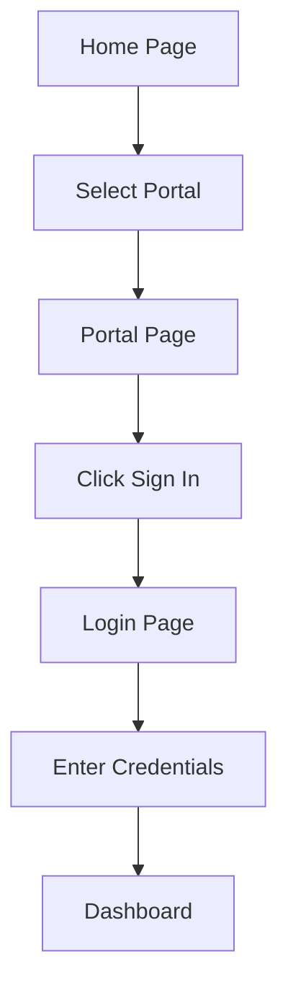
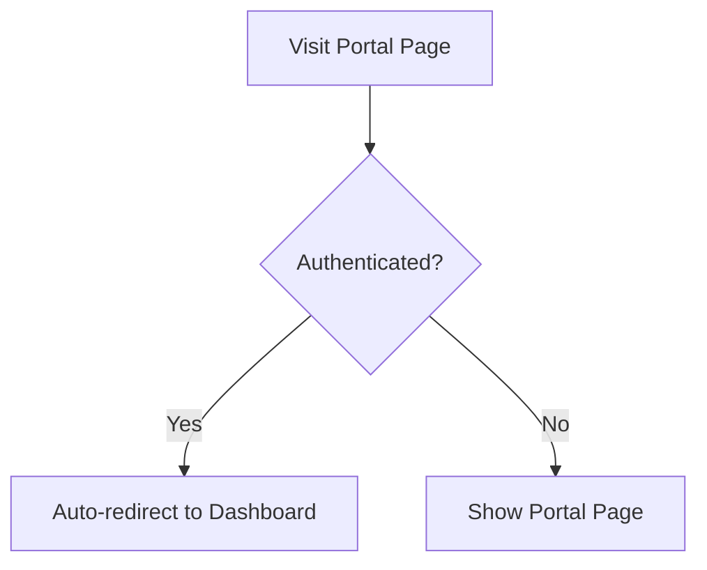

# Portal Separation Documentation

## 📋 Overview

This directory contains documentation for the professional separation of Admin, Faculty, and Student portals in the CCS Comprehensive Profiling System.

## 📚 Documentation Files

### [PORTAL_SEPARATION_IMPLEMENTATION.md](./PORTAL_SEPARATION_IMPLEMENTATION.md)
**Complete implementation guide** covering:
- Problem statement and solution architecture
- Detailed explanation of each portal page
- Navigation flow diagrams
- Route configuration updates
- Benefits and advantages
- File structure
- Testing checklist
- Future enhancements

**Read this if you want to:**
- Understand the full architecture
- Learn about the implementation details
- See the complete user flow
- Understand the benefits of this approach

### [QUICK_REFERENCE.md](./QUICK_REFERENCE.md)
**Quick reference guide** containing:
- Portal URLs and routes
- Color schemes for each portal
- Component file locations
- User flow diagrams
- Key features by portal
- Common tasks and code snippets
- Troubleshooting guide
- Best practices

**Read this if you want to:**
- Quickly find portal URLs
- Get code snippets for common tasks
- Troubleshoot issues
- Find file locations
- See color codes and styling

## 🎯 Quick Start

### For Developers

1. **Understanding the Structure**
   ```
   Home (/) → Portal Selection → Portal Page → Login → Dashboard
   ```

2. **Key Files to Know**
   - `client/src/pages/system-page/AdminPortalPage.jsx`
   - `client/src/pages/system-page/FacultyPortalPage.jsx`
   - `client/src/pages/system-page/StudentPortalPage.jsx`
   - `client/src/pages/system-page/HomePage.jsx`
   - `client/src/config/routeConfig.js`

3. **Portal URLs**
   - Admin: `/admin/portal`
   - Faculty: `/faculty/portal`
   - Student: `/student/portal`

### For Users

1. **Accessing Portals**
   - Visit the home page
   - Click on your portal card (Admin, Faculty, or Student)
   - Click "Sign In" on the portal page
   - Enter your credentials

2. **Direct Access**
   - Admin: Navigate to `/admin/portal`
   - Faculty: Navigate to `/faculty/portal`
   - Student: Navigate to `/student/portal`

## 🎨 Portal Themes

| Portal | Color | Theme |
|--------|-------|-------|
| **Admin** | 🟠 Orange | System administration and management |
| **Faculty** | 🔵 Blue | Academic management and profiling |
| **Student** | 🟢 Green | Personal profile and schedules |

## 🔑 Key Features

### ✅ Separation of Concerns
- Clean landing page without authentication logic
- Dedicated portal pages with specific branding
- Clear navigation flow

### ✅ Professional Appearance
- Portal-specific color schemes
- Feature showcases for each portal
- Consistent design language

### ✅ Better User Experience
- Clear portal selection
- Smooth authentication flow
- Role-appropriate redirects

### ✅ Scalability
- Easy to add new portals
- Simple customization per portal
- Maintainable code structure

## 🚀 Implementation Highlights

### Before
```javascript
// HomePage.jsx - Mixed concerns
- Landing page content
- Authentication checks
- Role-based redirects
- Portal selection
```

### After
```javascript
// HomePage.jsx - Clean landing page
- System branding
- Portal selection cards
- Features section

// AdminPortalPage.jsx - Dedicated portal
- Admin-specific branding
- Feature showcase
- Authentication-aware redirects
- Sign-in button

// FacultyPortalPage.jsx - Dedicated portal
- Faculty-specific branding
- Feature showcase
- Authentication-aware redirects
- Sign-in button

// StudentPortalPage.jsx - Dedicated portal
- Student-specific branding
- Feature showcase
- Authentication-aware redirects
- Sign-in button
```

## 📊 User Flow

### Unauthenticated User


### Authenticated User


## 🛠️ Common Tasks

### Customize Portal Features
Edit the `features` array in the respective portal page:
```javascript
const features = [
  {
    icon: <YourIcon className="text-3xl" />,
    title: 'Feature Title',
    description: 'Feature description'
  }
];
```

### Change Portal Colors
Update color classes in the portal page:
```javascript
// Button
className="bg-orange-600 hover:bg-orange-700"

// Icon
className="text-orange-600"
```

### Add New Portal
1. Create new portal page component
2. Add route to `routeConfig.js`
3. Add portal card to `PortalCards.jsx`
4. Update special routes if needed

## 📝 Testing

### Manual Testing Checklist
- [ ] Home page loads correctly
- [ ] Portal cards navigate to portal pages
- [ ] Portal pages show correct branding
- [ ] Sign-in buttons navigate to login pages
- [ ] Authenticated users redirect to dashboards
- [ ] Unauthenticated users see portal information
- [ ] Back to home buttons work
- [ ] Mobile responsive design works

### Test Accounts
Refer to [TEST_ACCOUNTS.md](../dual-portal-authentication/TEST_ACCOUNTS.md) for test credentials.

## 🔗 Related Documentation

- [Dual Portal Authentication](../dual-portal-authentication/)
- [Dynamic Routing](../dynamic-routing-documentations/)
- [Admin Dashboard](../admin-dashboard-documentations/)
- [Class Scheduling System](../class-scheduling-system/)

## 💡 Best Practices

1. **Keep portal pages focused** - Only portal information and sign-in
2. **Maintain consistent branding** - Use designated colors
3. **Clear call-to-action** - Prominent sign-in buttons
4. **Responsive design** - Test all screen sizes
5. **Loading states** - Show loading indicators
6. **Error handling** - Handle auth errors gracefully

## 🐛 Troubleshooting

See [QUICK_REFERENCE.md](./QUICK_REFERENCE.md#troubleshooting) for common issues and solutions.

## 📞 Support

For questions or issues:
1. Check the [Quick Reference](./QUICK_REFERENCE.md)
2. Review the [Implementation Guide](./PORTAL_SEPARATION_IMPLEMENTATION.md)
3. Check related documentation
4. Contact the development team

## 📅 Version History

- **v1.0.0** - Initial implementation with three separate portals
  - Created AdminPortalPage, FacultyPortalPage, StudentPortalPage
  - Updated HomePage to remove authentication logic
  - Updated PortalCards navigation
  - Updated route configuration

---

**Last Updated:** April 26, 2026  
**Status:** ✅ Implemented and Documented
